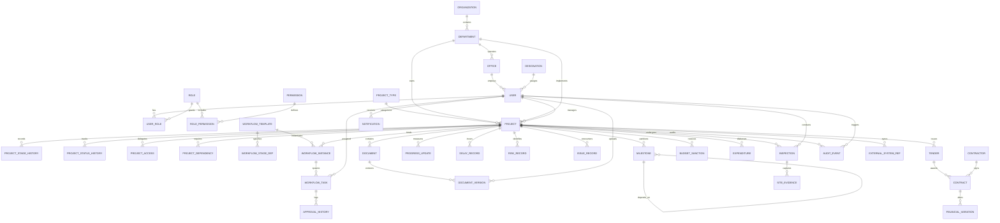

# Database Entity-Relationship Diagram & Schema Design

## Government Construction Project Workflow & Monitoring Platform

---

### 1. High-Level Entity-Relationship Model (Mermaid ERD)

---

### 2. Core Entity Definitions & Constraints

#### A. Identity, Organization & Authorization

##### `organizations`
* `id`: UUID (PK)
* `code`: VARCHAR(50) (UNIQUE, NOT NULL) — e.g., `GOV_GJ`
* `name`: VARCHAR(255) (NOT NULL) — e.g., `Government of Gujarat`
* `type`: ENUM (`STATE_GOVERNMENT`, `CENTRAL_GOVERNMENT`, `PUBLIC_SECTOR_UNDERTAKING`, `MUNICIPAL_CORPORATION`)
* `created_at`, `updated_at`: TIMESTAMPTZ

##### `departments`
* `id`: UUID (PK)
* `organization_id`: UUID (FK -> `organizations.id`, NOT NULL)
* `code`: VARCHAR(50) (UNIQUE, NOT NULL) — e.g., `RNB` (Roads & Buildings), `WRD` (Water Resources)
* `name`: VARCHAR(255) (NOT NULL)
* `head_of_department_id`: UUID (FK -> `users.id`, NULLABLE)
* `created_at`, `updated_at`: TIMESTAMPTZ

##### `offices`
* `id`: UUID (PK)
* `department_id`: UUID (FK -> `departments.id`, NOT NULL)
* `parent_office_id`: UUID (FK -> `offices.id`, NULLABLE) — Self-referential hierarchy
* `office_type`: ENUM (`HEAD_OFFICE`, `CIRCLE_OFFICE`, `DIVISION_OFFICE`, `SUB_DIVISION_OFFICE`, `FIELD_OFFICE`)
* `code`: VARCHAR(50) (UNIQUE, NOT NULL)
* `name`: VARCHAR(255) (NOT NULL)
* `district`: VARCHAR(100) (NOT NULL)
* `state`: VARCHAR(100) (NOT NULL)
* `address`: TEXT
* `created_at`, `updated_at`: TIMESTAMPTZ

##### `designations`
* `id`: UUID (PK)
* `code`: VARCHAR(50) (UNIQUE, NOT NULL) — e.g., `SE`, `EE`, `AE`, `JE`
* `title`: VARCHAR(150) (NOT NULL)
* `level`: INT (NOT NULL) — Hierarchical rank for authorization precedence
* `approval_limit_inr`: NUMERIC(15, 2) — ABAC financial signing ceiling

##### `users`
* `id`: UUID (PK)
* `employee_id`: VARCHAR(100) (UNIQUE, NOT NULL)
* `email`: VARCHAR(255) (UNIQUE, NOT NULL)
* `phone_number`: VARCHAR(20) (UNIQUE, NOT NULL)
* `password_hash`: VARCHAR(255) (NOT NULL)
* `full_name`: VARCHAR(255) (NOT NULL)
* `office_id`: UUID (FK -> `offices.id`, NOT NULL)
* `designation_id`: UUID (FK -> `designations.id`, NOT NULL)
* `jurisdiction`: JSONB — Geographic & departmental jurisdiction boundary metadata
* `is_active`: BOOLEAN (DEFAULT TRUE)
* `last_login_at`: TIMESTAMPTZ
* `created_at`, `updated_at`: TIMESTAMPTZ

##### `roles`, `permissions`, `user_roles`, `role_permissions`
* Standard normalized RBAC mapping supporting dynamic permission binding.

---

#### B. Project Registry & Master Data

##### `project_types`
* `id`: UUID (PK)
* `code`: VARCHAR(50) (UNIQUE, NOT NULL) — e.g., `ROAD`, `BRIDGE`, `HOSPITAL`, `SCHOOL`, `WATER_SUPPLY`
* `name`: VARCHAR(100) (NOT NULL)
* `description`: TEXT
* `default_workflow_template_id`: UUID (FK -> `workflow_templates.id`, NULLABLE)

##### `projects`
* `id`: UUID (PK)
* `project_code`: VARCHAR(100) (UNIQUE, NOT NULL) — e.g., `GJ-RNB-AHM-2026-000145` (Immutable)
* `name`: VARCHAR(300) (NOT NULL)
* `short_description`: VARCHAR(500) (NOT NULL)
* `detailed_description`: TEXT
* `project_type_id`: UUID (FK -> `project_types.id`, NOT NULL)
* `administrative_department_id`: UUID (FK -> `departments.id`, NOT NULL)
* `implementing_department_id`: UUID (FK -> `departments.id`, NOT NULL)
* `executing_office_id`: UUID (FK -> `offices.id`, NOT NULL)
* `project_owner_id`: UUID (FK -> `users.id`, NOT NULL)
* `project_manager_id`: UUID (FK -> `users.id`, NOT NULL)
* `status`: ENUM (`PROPOSED`, `UNDER_SCRUTINY`, `FEASIBILITY_APPROVED`, `ADMINISTRATIVELY_APPROVED`, `TECHNICAL_SANCTIONED`, `TENDERED`, `CONTRACT_AWARDED`, `IN_EXECUTION`, `WORK_SUSPENDED`, `PHYSICALLY_COMPLETED`, `TESTING_COMMISSIONING`, `HANDED_OVER`, `DEFECT_LIABILITY`, `CLOSED`, `CANCELLED`)
* `current_stage`: VARCHAR(100) (NOT NULL)
* `state`: VARCHAR(100) (NOT NULL)
* `district`: VARCHAR(100) (NOT NULL)
* `taluka`: VARCHAR(100) (NOT NULL)
* `city_village`: VARCHAR(100) (NOT NULL)
* `latitude`: NUMERIC(10, 7)
* `longitude`: NUMERIC(10, 7)
* `gis_geometry`: JSONB — Spatial GeoJSON polygon/linestring
* `estimated_cost_inr`: NUMERIC(15, 2) (NOT NULL)
* `sanctioned_cost_inr`: NUMERIC(15, 2)
* `contract_value_inr`: NUMERIC(15, 2)
* `total_expenditure_inr`: NUMERIC(15, 2) (DEFAULT 0)
* `funding_source`: VARCHAR(100) (e.g., `STATE_BUDGET`, `NABARD`, `WORLD_BANK`, `CENTRAL_SPONSORED`)
* `planned_start_date`: DATE (NOT NULL)
* `planned_end_date`: DATE (NOT NULL)
* `revised_end_date`: DATE
* `actual_start_date`: DATE
* `actual_end_date`: DATE
* `physical_progress_pct`: NUMERIC(5, 2) (DEFAULT 0.00, CHECK >= 0 AND <= 100)
* `financial_progress_pct`: NUMERIC(5, 2) (DEFAULT 0.00, CHECK >= 0 AND <= 100)
* `planned_progress_pct`: NUMERIC(5, 2) (DEFAULT 0.00, CHECK >= 0 AND <= 100)
* `schedule_variance_pct`: NUMERIC(5, 2) (DEFAULT 0.00)
* `created_by`: UUID (FK -> `users.id`, NOT NULL)
* `created_at`, `updated_at`: TIMESTAMPTZ

##### `project_status_histories` & `project_stage_histories`
* Immutable append-only transition logs recording prior state, new state, trigger event, reason, and actor ID.

---

#### C. Workflow & Approvals

##### `workflow_templates`
* `id`: UUID (PK)
* `code`: VARCHAR(50) (UNIQUE, NOT NULL)
* `name`: VARCHAR(200) (NOT NULL)
* `version`: INT (DEFAULT 1)
* `is_active`: BOOLEAN (DEFAULT TRUE)

##### `workflow_stage_definitions`
* `id`: UUID (PK)
* `template_id`: UUID (FK -> `workflow_templates.id`, NOT NULL)
* `stage_key`: VARCHAR(100) (NOT NULL)
* `stage_name`: VARCHAR(200) (NOT NULL)
* `order_index`: INT (NOT NULL)
* `execution_type`: ENUM (`SEQUENTIAL`, `PARALLEL_GATE`, `CONDITIONAL_BRANCH`)
* `prerequisite_stage_keys`: TEXT[]
* `required_designation_level`: INT
* `financial_threshold_min_inr`: NUMERIC(15, 2)
* `financial_threshold_max_inr`: NUMERIC(15, 2)
* `sla_hours`: INT (DEFAULT 72)
* `escalation_hours`: INT (DEFAULT 120)

##### `workflow_instances`
* `id`: UUID (PK)
* `project_id`: UUID (FK -> `projects.id`, UNIQUE, NOT NULL)
* `template_id`: UUID (FK -> `workflow_templates.id`, NOT NULL)
* `current_stage_key`: VARCHAR(100) (NOT NULL)
* `is_completed`: BOOLEAN (DEFAULT FALSE)
* `created_at`, `updated_at`: TIMESTAMPTZ

##### `workflow_tasks`
* `id`: UUID (PK)
* `instance_id`: UUID (FK -> `workflow_instances.id`, NOT NULL)
* `stage_key`: VARCHAR(100) (NOT NULL)
* `assigned_user_id`: UUID (FK -> `users.id`, NULLABLE)
* `assigned_office_id`: UUID (FK -> `offices.id`, NULLABLE)
* `assigned_designation_id`: UUID (FK -> `designations.id`, NULLABLE)
* `status`: ENUM (`PENDING`, `IN_PROGRESS`, `RECOMMENDED`, `APPROVED`, `REJECTED`, `REWORK_REQUESTED`, `ESCALATED`)
* `due_date`: TIMESTAMPTZ (NOT NULL)
* `escalated_at`: TIMESTAMPTZ
* `created_at`, `updated_at`: TIMESTAMPTZ

##### `approval_histories`
* `id`: UUID (PK)
* `task_id`: UUID (FK -> `workflow_tasks.id`, NOT NULL)
* `actor_id`: UUID (FK -> `users.id`, NOT NULL)
* `action`: ENUM (`RECOMMEND`, `APPROVE`, `REJECT`, `RETURN_FOR_REWORK`, `DELEGATE`)
* `remarks`: TEXT (NOT NULL)
* `conditions`: TEXT
* `delegated_to_id`: UUID (FK -> `users.id`, NULLABLE)
* `created_at`: TIMESTAMPTZ (DEFAULT NOW(), IMMUTABLE)

---

#### D. Documents, Milestones & Field Evidence

##### `documents`
* `id`: UUID (PK)
* `project_id`: UUID (FK -> `projects.id`, NOT NULL)
* `document_type`: ENUM (`DPR`, `FEASIBILITY_REPORT`, `ADMIN_SANCTION_ORDER`, `TECHNICAL_SANCTION_ORDER`, `LAND_ACQUISITION_CERT`, `ENV_CLEARANCE`, `TENDER_NIT`, `WORK_ORDER`, `CONTRACT_AGREEMENT`, `MEASUREMENT_BOOK`, `INSPECTION_REPORT`, `COMPLETION_CERTIFICATE`, `HANDOVER_RECEIPT`)
* `title`: VARCHAR(255) (NOT NULL)
* `current_version_number`: INT (DEFAULT 1)
* `is_approved`: BOOLEAN (DEFAULT FALSE)
* `created_at`, `updated_at`: TIMESTAMPTZ

##### `document_versions`
* `id`: UUID (PK)
* `document_id`: UUID (FK -> `documents.id`, NOT NULL)
* `version_number`: INT (NOT NULL)
* `file_path`: VARCHAR(500) (NOT NULL)
* `file_name`: VARCHAR(255) (NOT NULL)
* `file_size_bytes`: BIGINT (NOT NULL)
* `mime_type`: VARCHAR(100) (NOT NULL)
* `sha256_hash`: VARCHAR(64) (NOT NULL, IMMUTABLE)
* `uploaded_by_id`: UUID (FK -> `users.id`, NOT NULL)
* `revision_notes`: TEXT
* `created_at`: TIMESTAMPTZ (DEFAULT NOW(), IMMUTABLE)

##### `milestones`
* `id`: UUID (PK)
* `project_id`: UUID (FK -> `projects.id`, NOT NULL)
* `title`: VARCHAR(255) (NOT NULL)
* `description`: TEXT
* `weightage_pct`: NUMERIC(5, 2) (NOT NULL)
* `planned_start_date`: DATE (NOT NULL)
* `planned_end_date`: DATE (NOT NULL)
* `actual_start_date`: DATE
* `actual_end_date`: DATE
* `completion_pct`: NUMERIC(5, 2) (DEFAULT 0.00)
* `status`: ENUM (`NOT_STARTED`, `IN_PROGRESS`, `COMPLETED`, `DELAYED`, `FAILED`)
* `created_at`, `updated_at`: TIMESTAMPTZ

##### `inspections` & `site_evidence`
* Record site visits, checklist findings, GPS tags, photos/videos, and link to milestones.

---

#### E. Financials, Contracts & Cross-Cutting

##### `contractors`, `tenders`, `contracts`
* Comprehensive contractor profiles, tender competitive statements, contract milestones, security deposits, and bank guarantees.

##### `budget_sanctions`, `expenditures`, `financial_variations`
* Ledger of administrative vs. technical sanctions, treasury disbursements, and authorized variations with explicit justification.

##### `audit_events`
* `id`: UUID (PK)
* `project_id`: UUID (FK -> `projects.id`, NULLABLE)
* `actor_id`: UUID (FK -> `users.id`, NULLABLE)
* `actor_role`: VARCHAR(100)
* `actor_designation`: VARCHAR(150)
* `action`: VARCHAR(100) (NOT NULL)
* `entity_name`: VARCHAR(100) (NOT NULL)
* `entity_id`: VARCHAR(100) (NOT NULL)
* `old_state`: JSONB
* `new_state`: JSONB
* `reason`: TEXT
* `ip_address`: VARCHAR(45)
* `user_agent`: TEXT
* `timestamp`: TIMESTAMPTZ (DEFAULT NOW(), IMMUTABLE)

---

### 3. PostgreSQL Performance & Integrity Strategies
1. **Indexes:**
   * B-Tree on all Foreign Keys.
   * Composite B-Tree on `projects(status, administrative_department_id, district)`.
   * Composite B-Tree on `workflow_tasks(assigned_user_id, status, due_date)`.
   * GIST spatial index on `projects(gis_geometry)`.
   * Hash index on `document_versions(sha256_hash)`.
2. **ACID Transactions:** Every workflow action, milestone progress recalculation, and financial variation runs inside a Prisma/PostgreSQL interactive transaction.
