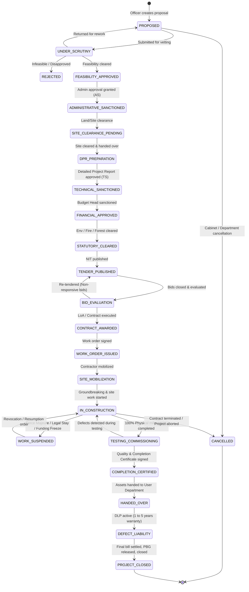

# Project State-Transition Model & Lifecycle Gates

## Government Construction Project Workflow & Monitoring Platform

---

### 1. Master Lifecycle State Machine

A capital project progresses through strictly governed, audited states. State transitions cannot be skipped; they require prerequisite artifacts, designated sign-offs, and automated consistency checks.

---

### 2. State-by-State Gate Specifications & Verification Rules

| State Key | Entry Prerequisites | Required Documents | Authorized Role(s) | Side Effects & Actions |
| :--- | :--- | :--- | :--- | :--- |
| **`PROPOSED`** | Minimum project details entered (Name, Type, Cost Estimate, Location, Problem Statement). | Concept Note / Initial Justification | Assistant Engineer (AE) / Executive Engineer (EE) | Generates immutable Project Code (`GJ-RNB-AHM-2026-000145`). Initial status history created. |
| **`UNDER_SCRUTINY`** | Proposal submitted by initiating office. | Preliminary Feasibility Checklist | Superintending Engineer (SE) / Scrutiny Committee | Creates workflow task in SE queue. Notifies Department Secretary. |
| **`ADMINISTRATIVE_SANCTIONED`** | Scrutiny cleared; economic/social justification approved. | Administrative Sanction (AS) Order with G.O. Number | Administrative Dept Secretary / Principal Secretary | Freezes baseline proposed scope. Creates financial AS allocation head. |
| **`SITE_CLEARANCE_PENDING`** | AS granted; revenue department survey required. | Revenue survey, cadastral map, NOC | District Collector / Competent Land Authority | Validates land availability or acquisition milestones. |
| **`TECHNICAL_SANCTIONED`** | Soil test, structural design, and Detailed Project Report (DPR) verified. | DPR, Detailed Estimates, Structural Drawings, TS Order | Chief Engineer (CE) / Superintending Engineer (SE) | Locks the baseline Technical Estimate. Pre-populates WBS milestones. |
| **`FINANCIAL_APPROVED`** | TS granted; budget allocation confirmed in state treasury. | Budget Allocation Order / FD Concurrence | Finance Controller / Finance Department | Allocates official Treasury Head of Account and ceiling amount. |
| **`STATUTORY_CLEARED`** | Parallel statutory approvals complete. | Environmental Clearance, Forest NOC, Fire Safety Clearance | Regulatory Board / SE | Aggregation gate: all parallel clearances must resolve before tendering. |
| **`TENDER_PUBLISHED`** | Commercial terms, tender notice (NIT) drafted. | Notice Inviting Tender (NIT), Tender Document | Executive Engineer (EE) | Records e-Procurement Portal tender ID. Starts tender countdown SLA. |
| **`CONTRACT_AWARDED`** | Technical & financial bids evaluated; L1 contractor selected. | Bid Evaluation Report, Letter of Acceptance (LoA) | Chief Engineer / Tender Committee | Registers Contractor in project, binds Contract Agreement and Performance Security. |
| **`WORK_ORDER_ISSUED`** | Performance Bank Guarantee (PBG) verified; contract signed. | Signed Contract, Official Work Order | Executive Engineer (EE) | Sets scheduled completion date baseline. Unlocks field site mobilization. |
| **`IN_CONSTRUCTION`** | Site handover complete; contractor mobilized equipment and labor. | Joint Site Handover Memo, Mobilization Report | Assistant Engineer (AE) / Field Engineer | Enables progress updates, inspection submissions, and measurement book entries. |
| **`WORK_SUSPENDED`** | Formal stop-work order (legal injunction, natural disaster, default). | Suspension Order with legal / administrative reason | Chief Engineer / Department Secretary | Halts schedule variance clock; creates high-severity delay record. |
| **`TESTING_COMMISSIONING`** | All scheduled construction milestones report 100% physical completion. | Pre-commissioning inspection checklist, test reports | Quality Control Team / Executive Engineer | Field testing of electrical, civil, and mechanical integrity. |
| **`COMPLETION_CERTIFIED`** | Commissioning tests passed; punch list rectified. | Final Completion Certificate, As-Built Drawings | Superintending Engineer / Chief Engineer | Freezes physical progress at 100%. Initiates financial reconciliation. |
| **`HANDED_OVER`** | Implementing agency formally hands over physical asset to user department. | Handover & Takeover Certificate (Jointly Signed) | Implementing EE & Beneficiary Dept Head | Asset transferred. Defect Liability Period (DLP) clock commences. |
| **`DEFECT_LIABILITY`** | Handover complete. Warranty active. | DLP Periodic Inspection Reports | Executive Engineer & Quality Team | Monitors contractor defect rectifications. Retention money held. |
| **`PROJECT_CLOSED`** | DLP expired without open defects; final bill paid; PBG released. | Final Bill Voucher, PBG Release Order, Closure Order | Executive Engineer & Finance Controller | Project moved to archived state. Audit log finalized and sealed. |

---

### 3. Rework & Return Mechanics

1. **Non-Destructive Return:**
   * An approving officer can invoke `RETURN_FOR_REWORK` at any review stage.
   * The project state moves backwards to the targeted rework stage (e.g., from `TECHNICAL_SANCTION` back to `DPR_PREPARATION`).
   * The complete prior submission, attached documents, remarks, and rejection notices remain immutably preserved in `approval_histories` and `audit_events`.
2. **Re-Submission:**
   * The submitter updates the relevant parameters or uploads a new `DocumentVersion`.
   * Re-submission increments the workflow task iteration count and re-routes the task to the reviewer's queue.

---

### 4. Exception & Guard Rules

* **Financial Ceiling Guard:** An Executive Engineer cannot issue Technical Sanction for a project whose estimated cost exceeds their statutory delegation limit (e.g., ₹2 Crore). The engine blocks the action and enforces escalation to Superintending Engineer or Chief Engineer.
* **Separation of Duties (Maker-Checker):** The officer who drafted the DPR or estimated the tender cannot act as the sole approver of the Technical Sanction or Tender Award.
* **Unresolved Critical Issue Gate:** Transition to `COMPLETION_CERTIFIED` is programmatically blocked if there exist open issues marked `SEVERITY = CRITICAL` or failed inspections without documented rectification.
